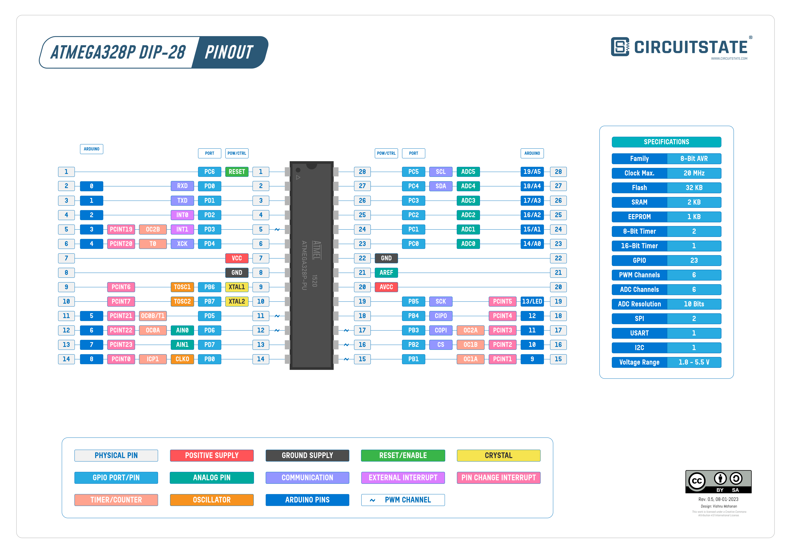

# Arduino Resources

This repository is dedicated to learning about Arduino and the ATmega328p
microcontroller. 

**Important:** This respository does not use the Arduino abstraction layer built
on top the AVR libc. So there are no methods like `digitalWrite()`, `setup()`
or `loop()`. If you wish to work on top of the Arduino abstraction layer, this
tutorial is not neccessary, just download the Arduino IDE and hit upload.

## Getting Started: Installing the development toolchain

There are several ways to obtain the Arduino developement toolchain. The easiest
way is to piggyback on the `avr-gcc` toolchain installed with the Arduino IDE.
On MacOS, you can find the toolchain at `~/Library/Arduino15/packages/arduino/tools`.

However, downloading and installing the `avr-gcc` toolchain in a seperate 
directory allows for better organization and removes the Arduino IDE dependency.

The following toolchain components need to be installed

  1. avr-binutils
  2. avr-gcc
  3. avr-libc
  4. avrdude (for uploading code to the arduino)

A tutorial for installing all these components can be found at [https://www.nongnu.org/avr-libc/user-manual/install_tools.html#path](https://www.nongnu.org/avr-libc/user-manual/install_tools.html#path)

There are two files, `config.sub` and `config.guess` that seem to be out of
date for the latest release of avr-libc. Before the configure step, it is 
advisable to replace these two files with the latest version found at 
[https://github.com/gcc-mirror/gcc/tree/master](https://github.com/gcc-mirror/gcc/tree/master)

## Compile, Link and Upload

Once you have installed the toolchain, the compile, link and uplaod process
to the Arduino is also not trivial. The following is the Makefile used for
compiling the code in the hello-world directory. This Makefile assumes the
toolchain was installed in the repository root under a directory named `avr-gcc/`. 

```make
CC=avr-gcc/avr/bin/avr-gcc
MMCU=atmega328p
CPU_CLK_SPEED=16000000UL
PROGRAMMER=arduino
AVRDUDE=avr-gcc/avr/bin/avrdude
OBJCOPY=avr-gcc/avr/bin/avr-objcopy

hello: hello.c
	$(CC) -Os -mmcu=$(MMCU) -DF_CPU=$(CPU_CLK_SPEED) hello.c -o hello.elf
	$(OBJCOPY) -j .text -j .data -O ihex hello.elf hello.hex

upload: hello.hex
	$(AVRDUDE) -c $(PROGRAMMER) -p $(MMCU) -P /dev/cu.usbmodem1101 -U flash:w:hello.hex:i
	
```

## Programs

### SOS Program

The SOS program blinks an LED attached to PIN 7 on the arduino in a SOS pattern

### Traffic Light Simulator

Simulates a Traffic light cycle

## ATmega328p DIP edition Pin Diagram


The datasheet for the ATmega328p microcontroller can be downloaded at
[https://ww1.microchip.com/downloads/en/DeviceDoc/Atmel-7810-Automotive-Microcontrollers-ATmega328P_Datasheet.pdf](https://ww1.microchip.com/downloads/en/DeviceDoc/Atmel-7810-Automotive-Microcontrollers-ATmega328P_Datasheet.pdf)


